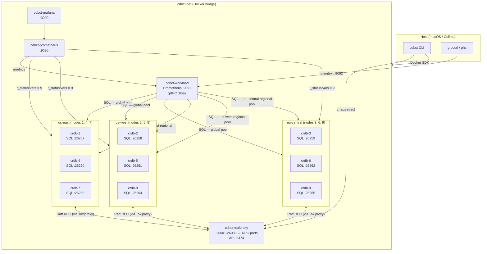
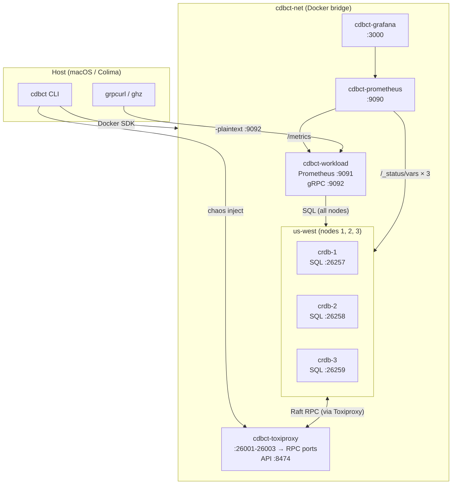
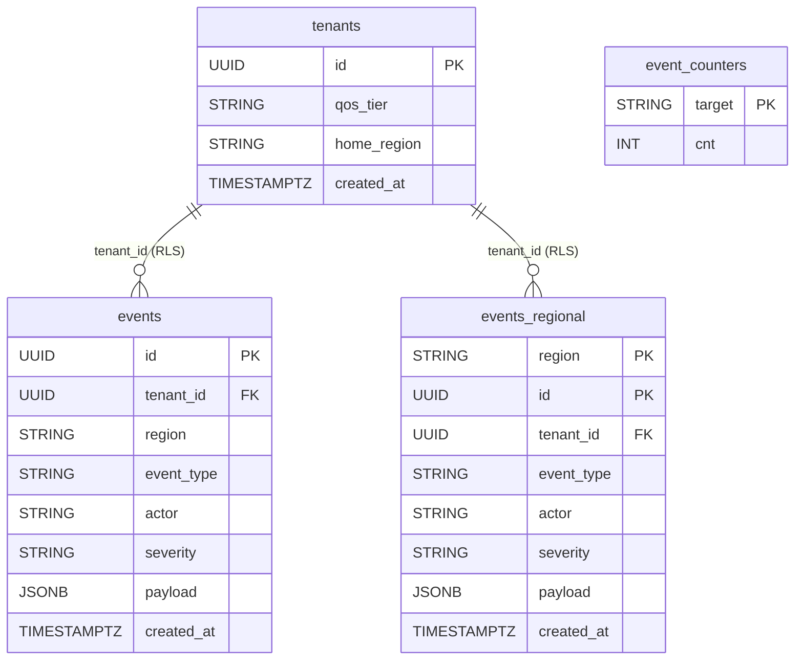
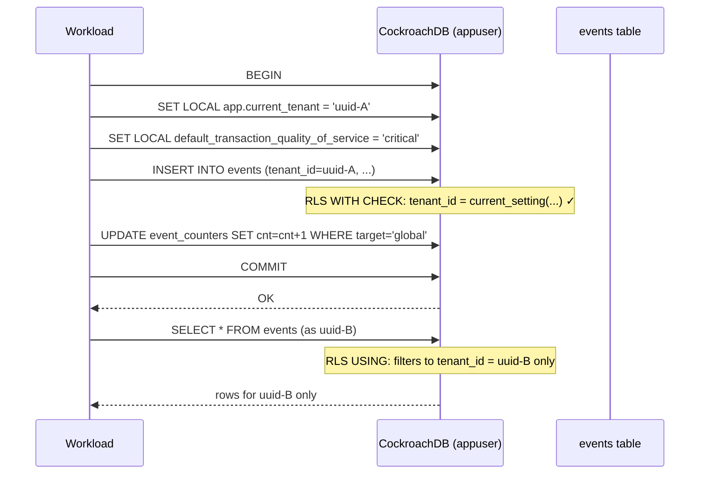
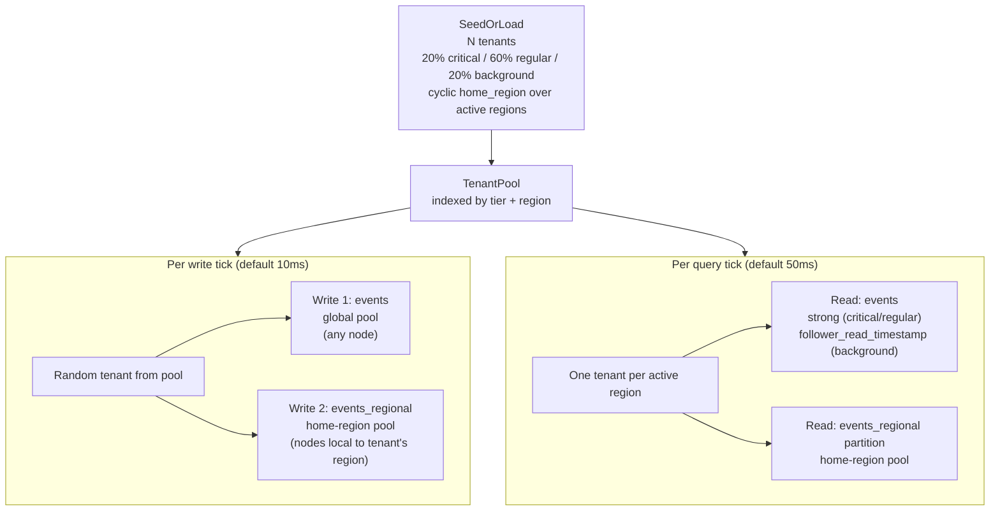
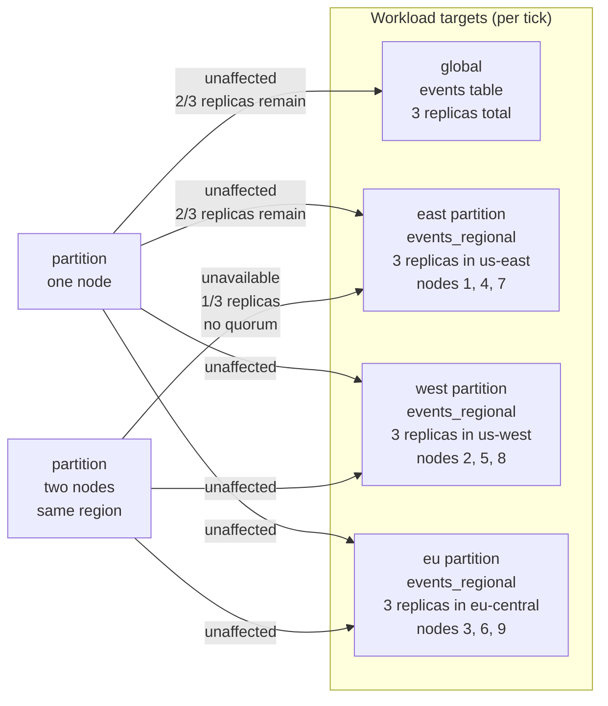
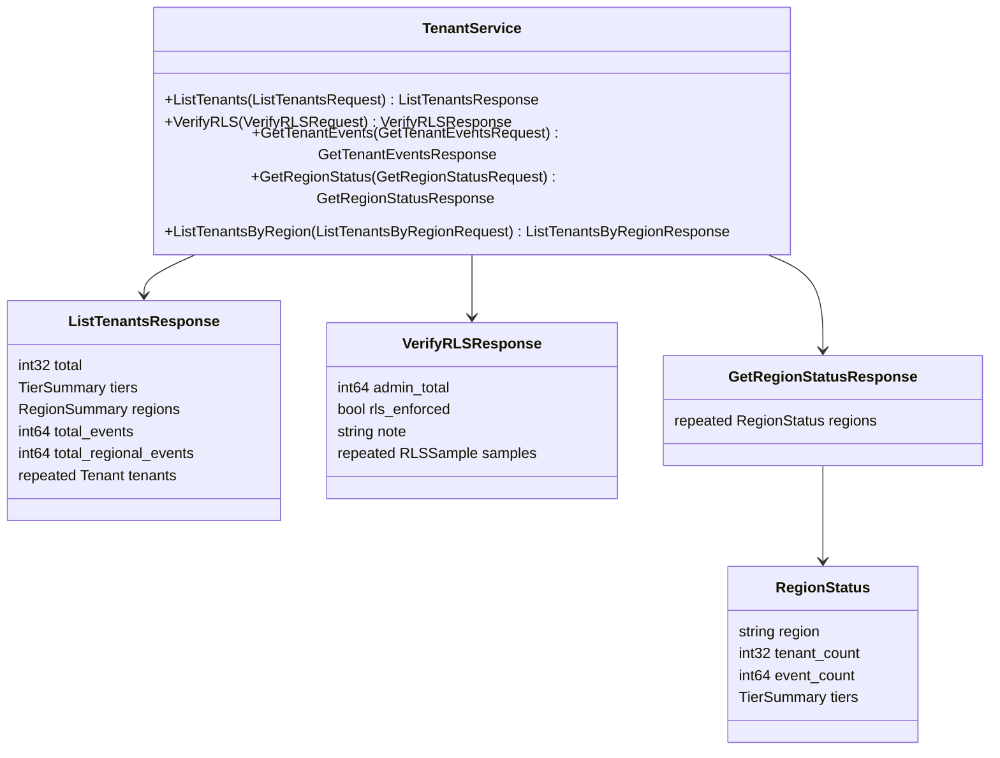

# cdbct — CockroachDB Cluster Tester

A CLI tool that orchestrates a CockroachDB cluster in Docker, drives a geo-partitioned multi-tenant workload, injects network chaos via Toxiproxy, and surfaces everything in Prometheus, Grafana, and a gRPC API. Built to demonstrate CockroachDB's resilience, Row-Level Security, and admission control under real failure modes.

Structurally mirrors [russ](https://github.com/joshdurbin/russ): same library choices (cobra, viper, zerolog, Docker SDK, pond, gofakeit), same pattern of no shell-outs — all Docker interaction goes through the Go SDK.

---

## Installations

Two discrete installation types are supported. Choose one — there is no migration path between them.

| | `multi-geo-cluster` | `single-region-cluster` |
|---|---|---|
| Nodes | 9 (3 per region) | 3 |
| Regions | us-east, us-west, eu-central | us-west only |
| Geo-partitioning | ✓ | — (schema exists, only west partition written) |
| Zone configs | All 3 partitions | west partition only |
| Regional latency baselines | ✓ (42/55/61ms) | — |
| Chaos | Full (partition, latency, bandwidth, timeout, reset) | Full |
| Toxiproxy | ✓ | ✓ |
| Prometheus + Grafana | ✓ | ✓ |
| RLS / QoS | ✓ | ✓ |

---

## Quick start

**Multi-geo (default demo):**
```bash
cdbct quickstart multi-geo-cluster
```

**Single-region (simpler setup):**
```bash
cdbct quickstart single-region-cluster
```

Both commands:
1. Pull images and create the cluster with Toxiproxy wired between all nodes
2. Assign node localities so zone configs and home-region routing work correctly
3. Start Prometheus and Grafana with pre-provisioned datasource and dashboards
4. Build and start the workload container (seeds tenant pool, runs migrations, starts gRPC server)
5. Apply zone configs with retry

> **Wait ~2 minutes** after quickstart before running chaos. CockroachDB's replication queue needs time to apply zone configs and settle replica placement.

---

## Prerequisites

- [Colima](https://github.com/abiosoft/colima) with at least **8 CPUs and 12 GB RAM** for multi-geo (4 CPUs / 6 GB is sufficient for single-region):
  ```bash
  colima stop
  colima start --cpu 8 --memory 12
  ```
- Go 1.25+
- [sqlc](https://sqlc.dev) (`brew install sqlc`) — only needed if modifying queries
- [buf](https://buf.build) (`brew install buf`) — only needed if modifying the proto

---

## Architecture

### Multi-geo cluster (9 nodes, 3 regions)



All inter-node Raft RPC traffic is routed through Toxiproxy. SQL connections bypass it. Chaos commands target specific node-to-node RPC paths without touching the workload's SQL connections.

The workload maintains a **global pool** (all nodes, for the `events` table) and a **per-region pool** (nodes local to each region, for `events_regional`). Home-region writes reach the leaseholder in one LAN hop instead of a potential WAN hop.

### Single-region cluster (3 nodes, us-west)



Single-region uses the same Toxiproxy architecture — chaos injection (partition, latency, etc.) works identically. No inter-region latency baselines are applied. All tenants are homed to us-west; only the `west` partition in `events_regional` receives writes.

---

## Schema and data model



### `events` — resilient baseline

3 replicas, balanced across all nodes. Survives any single-node failure — leaseholder re-election in ~10s.

### `events_regional` — geo-partitioned

Partitioned by `region`. Schema always defines three partitions (`east`, `west`, `eu`). In multi-geo mode all three receive writes; in single-region mode only `west` is written to and zone configs are applied only for `us-west`.

```sql
ALTER PARTITION west OF TABLE events_regional CONFIGURE ZONE USING
    num_replicas = 3,
    constraints  = '[+region=us-west]',
    lease_preferences = '[[+region=us-west]]';
-- multi-geo: same for east → us-east, eu → eu-central
```

Partition key prefix `(region, id)` ensures inserts land in the correct range without hotspots.

### `event_counters` — write-side counters

Four rows (`global / east / west / eu`) incremented atomically inside each insert transaction. `ListTenants` reads from this table instead of running `SELECT COUNT(*)` — a 4-row primary-key scan instead of a full table scan.

### Row-Level Security

Both event tables have RLS enabled. `appuser` (the workload service account) can only see rows where `tenant_id = current_setting('app.current_tenant')::UUID`. Every write transaction sets `SET LOCAL app.current_tenant = '<uuid>'` before the insert.



### CockroachDB best practices applied

| Practice | Implementation |
|---|---|
| Distributed primary keys | `gen_random_uuid()` — uniform write distribution |
| No write hotspots | Region-prefixed composite PK on partitioned table |
| Geo-partitioning | `PARTITION BY LIST` + per-partition `CONFIGURE ZONE` |
| Locality-aware placement | `--locality=region=X` on each node |
| Write-side counters | `event_counters` updated in-transaction, replaces `COUNT(*)` scans |
| Multi-tenant isolation | Row-Level Security with `current_setting` session variable |
| Admission control QoS | `SET LOCAL default_transaction_quality_of_service` per tenant tier |

---

## Workload design



The workload is region-aware: it only iterates regions present in the topology. For single-region, all tenants are in us-west and only the us-west pool is created.

---

## The resilience demo (multi-geo)

With 9 nodes (3 per region), each geo-partition has 3 replicas in its home region. Losing a single node is transparent to the workload.



```bash
# Single-node partition — UNAFFECTED (2/3 replicas still up)
cdbct chaos inject partition 1
# Watch Grafana: all write rates stay flat, ranges_unavailable stays 0

cdbct chaos clear

# Two-node partition in same region — east goes down, west/eu unaffected
cdbct chaos inject partition 1
cdbct chaos inject partition 4
# Watch Grafana: east write rate → 0, unavailable ranges > 0, west/eu continue

cdbct chaos clear
```

| Scenario | east partition | west partition | eu partition | global |
|---|---|---|---|---|
| Partition 1 node (any region) | ✓ up (2/3 replicas) | ✓ up | ✓ up | ✓ up |
| Partition 2 nodes (same region) | ✗ down (1/3, no quorum) | ✓ up | ✓ up | ✓ up |
| Partition all 3 east nodes | ✗ down | ✓ up | ✓ up | ✓ up |

---

## Commands

### Quickstart

```bash
# Multi-geo: 9-node, 3-region geo-distributed cluster (shared flags below)
cdbct quickstart multi-geo-cluster
cdbct quickstart multi-geo-cluster --nodes=9 --no-faults
cdbct quickstart multi-geo-cluster --tenants=25 --interval=200ms

# Single-region: 3-node, us-west only (always 3 nodes, no regional latencies)
cdbct quickstart single-region-cluster
cdbct quickstart single-region-cluster --tenants=50 --interval=50ms

# Shared flags (apply to both subcommands via persistent parent flags):
#   --name          cluster name (default: "default")
#   --interval      write tick interval (default: 10ms)
#   --batch         events inserted per tick (default: 10)
#   --query-every   read tick interval (default: 50ms)
#   --tenants       tenant pool size to seed (default: 1000)

cdbct destroy     # tear down everything (stop all containers + delete volumes)
```

### Cluster

```bash
cdbct cluster create                         # 9-node multi-geo cluster (default)
cdbct cluster create --mode=single-region    # 3-node us-west cluster
cdbct cluster create --mode=multi-geo --nodes=5
cdbct cluster scale                          # hot-add a node (reads topology from labels)
cdbct cluster ls
cdbct cluster status
cdbct cluster rm                             # stop (keep volumes)
cdbct cluster rm --purge                     # stop + delete volumes
```

### Workload

```bash
cdbct workload start                                  # rebuild image + start (infers topology from existing cluster)
cdbct workload start --mode=single-region             # explicit topology for host-side DSN construction
cdbct workload start --tenants=25 --interval=200ms
cdbct workload stop
cdbct workload ls
```

`--tenants` distributes across QoS tiers: 20% critical / 60% regular / 20% background. Pool persists in the DB across restarts.

### Regional latency baselines (multi-geo only)

`quickstart multi-geo-cluster` automatically injects realistic inter-region latency into every node's Toxiproxy proxy. Values are derived from well-known cloud datacenter RTTs:

| Link | RTT | One-way |
|---|---|---|
| us-east ↔ us-west | ~72ms | 36ms |
| us-east ↔ eu-central | ~95ms | 48ms |
| us-west ↔ eu-central | ~150ms | 75ms |

Each proxy receives the average one-way delay from its region to the other two:

| Region | Nodes | Proxy latency | Derivation |
|---|---|---|---|
| us-east | 1, 4, 7 | **42ms ±5ms** | avg(36ms→west, 48ms→eu) |
| us-west | 2, 5, 8 | **55ms ±8ms** | avg(36ms→east, 75ms→eu) |
| eu-central | 3, 6, 9 | **61ms ±10ms** | avg(48ms→east, 75ms→west) |

Each proxy gets two toxics (`name-up` / `name-down`) so they coexist and stack additively with user-injected faults.

```bash
cdbct chaos clear       # removes ALL faults including regional baselines
cdbct chaos regional    # re-apply regional baselines after a clear (multi-geo only)
cdbct chaos status      # shows both regional and injected toxics per proxy
```

### Chaos

All chaos targets inter-node **RPC** traffic through Toxiproxy. SQL connections are not affected. Works for both installation types.

```bash
cdbct chaos inject latency 2 --latency=200 --jitter=50   # 200ms ±50ms on node 2 RPC
cdbct chaos inject bandwidth 3 --rate=100                 # throttle node 3 to 100 KB/s
cdbct chaos inject timeout 1 --timeout=3000               # hang then close after 3s
cdbct chaos inject partition 2                            # full network partition
cdbct chaos inject reset 1                                # TCP RST, forces retries
cdbct chaos clear                                         # remove all faults
cdbct chaos clear 2                                       # remove faults on node 2 only
cdbct chaos status                                        # show active toxics with parameters
```

| Fault type | Toxiproxy mechanism | CockroachDB effect |
|---|---|---|
| `latency` | `latency` toxic | Slows Raft heartbeats; latency alerts |
| `bandwidth` | `bandwidth` toxic | Throttles replication throughput |
| `timeout` | `timeout` toxic | gRPC timeouts; leaseholder re-election |
| `partition` | proxy disabled | No TCP accepted; leaseholder loses quorum |
| `reset` | `reset_peer` toxic | TCP RST on every connection; retry storms |

### Observability

```bash
cdbct obs setup       # start Prometheus + Grafana
cdbct obs teardown
```

---

## Grafana dashboards

Both dashboards are embedded in the binary and provisioned automatically. Grafana opens with no login required.

### Geo-Partition Resilience + Multi-Tenant (`/d/cdbct-workload`)

Shows two stories simultaneously:
- **By `target`** (global/east/west/eu): write rate, errors, p99 latency — geo-partition resilience
- **By `qos`** (critical/regular/background): write rate, errors, p99 latency — admission control divergence under load

Also shows `ranges_unavailable`, `ranges_underreplicated`, `liveness_livenodes`, and liveness heartbeat latency.

### CockroachDB Overview (`/d/cdbct-crdb-overview`)

Cluster-wide: SQL statement/transaction rates, p99 latency, CPU/memory per node, range health, storage capacity.

---

## Workload gRPC API

The workload container exposes a gRPC server on `localhost:9092` with **server reflection** enabled. No `.proto` file needed on the client side.

Prometheus metrics remain on `localhost:9091/metrics`.

### Service: `cdbct.v1.TenantService`



`GetRegionStatus` returns only regions that have tenants — in single-region mode this is just `us-west`.

---

### Discovery

```bash
grpcurl -plaintext localhost:9092 list
grpcurl -plaintext localhost:9092 describe cdbct.v1.TenantService
grpcurl -plaintext localhost:9092 describe cdbct.v1.ListTenantsResponse
grpcurl -plaintext localhost:9092 describe cdbct.v1.VerifyRLSResponse
```

---

### `ListTenants`

```bash
grpcurl -plaintext localhost:9092 cdbct.v1.TenantService/ListTenants
```

```json
{
  "total": 10,
  "tiers":   { "critical": 2, "regular": 6, "background": 2 },
  "regions": { "usEast": 4, "usWest": 3, "euCentral": 3 },
  "totalEvents": "83100",
  "totalRegionalEvents": "83100"
}
```

---

### `VerifyRLS`

Proves RLS enforcement by sampling one tenant per home region and comparing their visible row count against the admin total.

```bash
grpcurl -plaintext localhost:9092 cdbct.v1.TenantService/VerifyRLS
```

```json
{
  "adminTotal": "83100",
  "rlsEnforced": true,
  "samples": [
    { "tenantId": "3f2a1b4c-...", "qosTier": "critical",   "visibleRows": "8312", "rlsEnforced": true },
    { "tenantId": "8e9d0c1a-...", "qosTier": "regular",    "visibleRows": "8290", "rlsEnforced": true }
  ]
}
```

---

### `GetRegionStatus`

**Most useful call during chaos.** Returns per-region tenant counts, QoS distributions, and partition event counts. Tenant data is served from the in-memory pool (zero DB cost); event counts are a 4-row PK scan.

```bash
grpcurl -plaintext localhost:9092 cdbct.v1.TenantService/GetRegionStatus
```

```json
{
  "regions": [
    { "region": "us-east",    "tenantCount": 4, "eventCount": "27700", "tiers": { "critical": 1, "regular": 2, "background": 1 } },
    { "region": "us-west",    "tenantCount": 3, "eventCount": "27800", "tiers": { "critical": 1, "regular": 2, "background": 0 } },
    { "region": "eu-central", "tenantCount": 3, "eventCount": "27600", "tiers": { "critical": 0, "regular": 2, "background": 1 } }
  ]
}
```

When the east partition is unavailable, `eventCount` for `us-east` stops growing while the others continue.

---

### `GetTenantEvents`

```bash
grpcurl -plaintext \
  -d '{"tenant_id": "3f2a1b4c-363c-4002-8fdc-69a18783da3a"}' \
  localhost:9092 cdbct.v1.TenantService/GetTenantEvents
```

---

### `ListTenantsByRegion`

```bash
grpcurl -plaintext \
  -d '{"region": "us-east"}' \
  localhost:9092 cdbct.v1.TenantService/ListTenantsByRegion
```

---

### Load testing with `ghz`

`ghz` uses `--insecure` instead of `grpcurl`'s `-plaintext`.

```bash
# Baseline: 10 RPS for 30s
ghz --insecure --call cdbct.v1.TenantService.ListTenants --rps 10 -z 30s localhost:9092

# Concurrency burst
ghz --insecure --call cdbct.v1.TenantService.ListTenants --concurrency 50 --total 500 localhost:9092

# VerifyRLS under load (heavier — runs per-tenant index scans)
ghz --insecure --call cdbct.v1.TenantService.VerifyRLS --rps 5 -z 30s localhost:9092

# Saturation test — observe admission control divergence between QoS tiers
ghz --insecure --call cdbct.v1.TenantService.ListTenants --rps 100 -z 30s --timeout 10s localhost:9092
```

---

## Prometheus scrape targets

| Job | Target | What it scrapes |
|---|---|---|
| `cockroachdb` | `cdbct-crdb-{1..N}:8080` | `/_status/vars` — all CRDB internal metrics |
| `cdbct_workload` | `cdbct-workload:9091` | `/metrics` — per-target + per-QoS write/read rates and latencies |

---

## Development

```bash
make build         # compile ./cdbct
make proto         # regenerate gRPC stubs from proto/
make generate      # regenerate sqlc query code from internal/queries/
make tidy          # go mod tidy + verify
make lint          # go vet
make fmt           # gofmt
make clean         # remove binary
make docker-clean  # docker system prune -af --volumes + remove all named volumes
```

Rebuild the workload container after changing any Go source:

```bash
cdbct workload stop
docker rmi cdbct-workload:latest
cdbct workload start
```

---

## Project structure

```
.
├── proto/cdbct/v1/tenant.proto   # gRPC service definition
├── buf.yaml / buf.gen.yaml       # buf proto toolchain config
├── sqlc.yaml                     # sqlc config
├── Makefile
├── main.go
├── cmd/
│   ├── root.go                   # cobra root, zerolog, viper
│   ├── cluster.go                # cluster create/scale/ls/rm/status  (--mode flag)
│   ├── workload.go               # workload start/stop/ls             (--mode flag)
│   ├── chaos.go                  # chaos inject / clear / regional / status
│   ├── obs.go                    # obs setup/teardown
│   ├── quickstart.go             # quickstart multi-geo-cluster | single-region-cluster
│   └── destroy.go                # tear down everything
└── internal/
    ├── gen/cdbct/v1/             # generated gRPC stubs (do not edit)
    ├── db/                       # sqlc-generated query code (do not edit)
    ├── cockroach/
    │   ├── client.go             # pgx pool, goose migrations, ping retry
    │   ├── retry.go              # serialization failure (40001) retry wrapper
    │   └── zone_configs.go       # CONFIGURE ZONE with retry, filtered by active regions
    ├── chaos/
    │   └── client.go             # Toxiproxy HTTP API — fault injection + proxy management
    ├── docker/
    │   ├── manager.go            # Docker client, network/volume/label helpers
    │   ├── topology.go           # ClusterTopology type — multi-geo / single-region modes
    │   ├── cluster.go            # CRDB container lifecycle, cockroach init, locality flags
    │   ├── chaos.go              # Toxiproxy container + regional latency application
    │   ├── obs.go                # Prometheus + Grafana via CopyToContainer
    │   ├── workload.go           # workload image build + container start (topology-aware DSNs)
    │   ├── network.go            # networkConfig helper
    │   └── grafana/              # embedded dashboard JSON + provisioning YAML
    ├── migrations/
    │   ├── 00001_initial_schema.sql   # events, events_regional (3 partitions always), indexes
    │   ├── 00002_multi_tenancy.sql    # tenants, appuser, RLS policies
    │   ├── 00003_counters.sql         # event_counters (write-side counters)
    │   ├── 00004_home_region.sql      # home_region column
    │   ├── 00005_composite_index.sql  # region + id composite index
    │   └── embed.go
    ├── queries/
    │   ├── schema.sql            # sqlc schema
    │   ├── audit.sql             # event insert + read queries
    │   └── tenants.sql           # tenant pool + counter queries
    └── workload/
        ├── runner.go             # tick loop; derives active regions from RegionalDSNs
        ├── tenant.go             # TenantPool — seed/load, ActiveRegions(), QoS distribution
        ├── grpc_server.go        # TenantService impl; iterates tenants.ActiveRegions()
        └── metrics.go            # Prometheus metrics server (target + qos labels)
```

---

## Libraries

Follows [russ](https://github.com/joshdurbin/russ)'s conventions throughout:

| Purpose | Library |
|---|---|
| CLI | `spf13/cobra` |
| Config / env | `spf13/viper` |
| Logging | `rs/zerolog` |
| Docker SDK | `docker/docker` v27 |
| CockroachDB driver | `jackc/pgx/v5` |
| Migrations | `pressly/goose/v3` |
| Query generation | `sqlc-dev/sqlc` |
| Proto toolchain | `buf.build` + `protoc-gen-go` + `protoc-gen-go-grpc` |
| gRPC | `google.golang.org/grpc` |
| Chaos proxy client | `Shopify/toxiproxy/v2` |
| Fake data | `brianvoe/gofakeit/v7` |
| Worker pools | `alitto/pond/v2` |
| Concurrency | `golang.org/x/sync` |
| Metrics | `prometheus/client_golang` |
