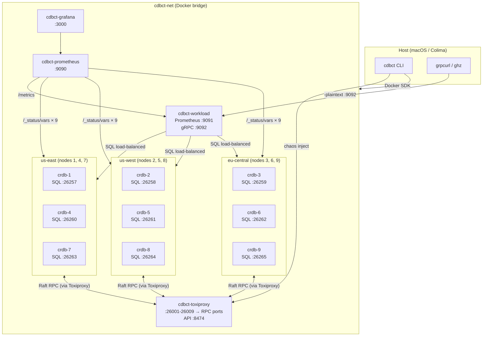
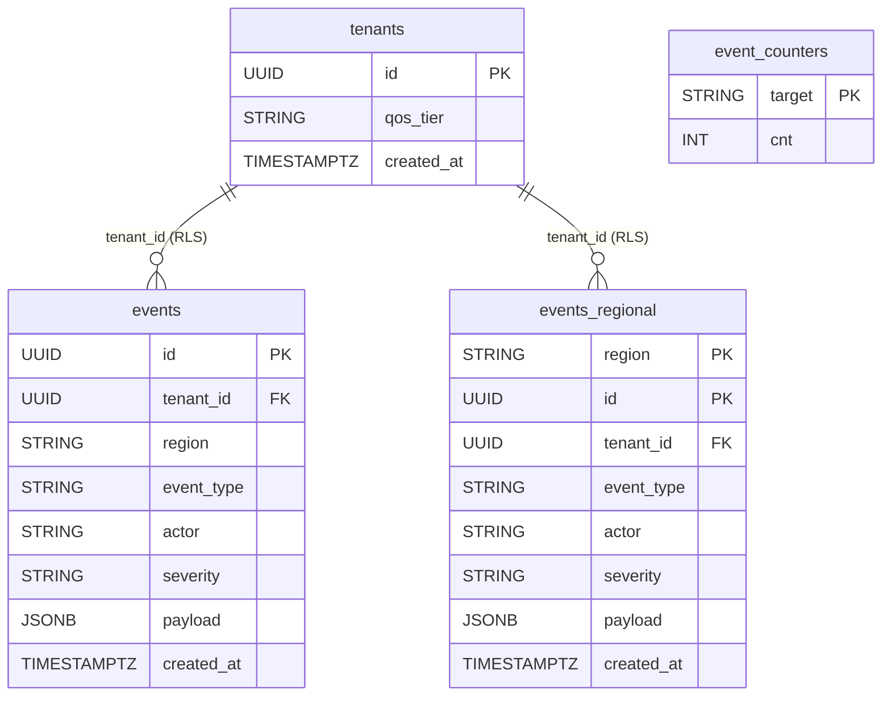
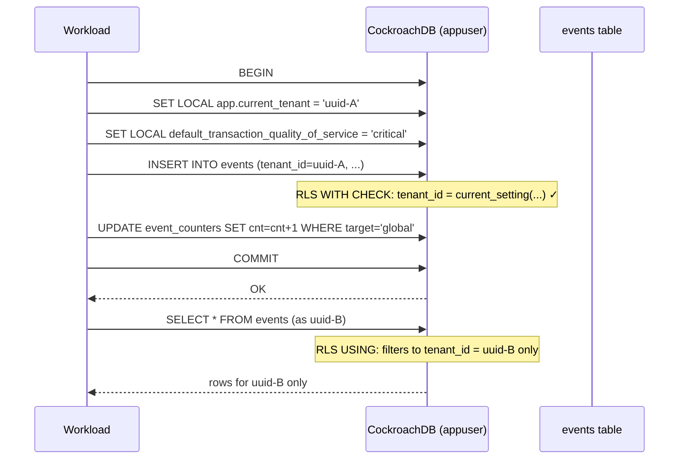
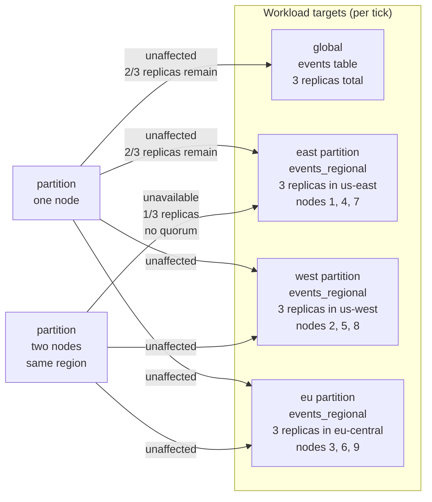
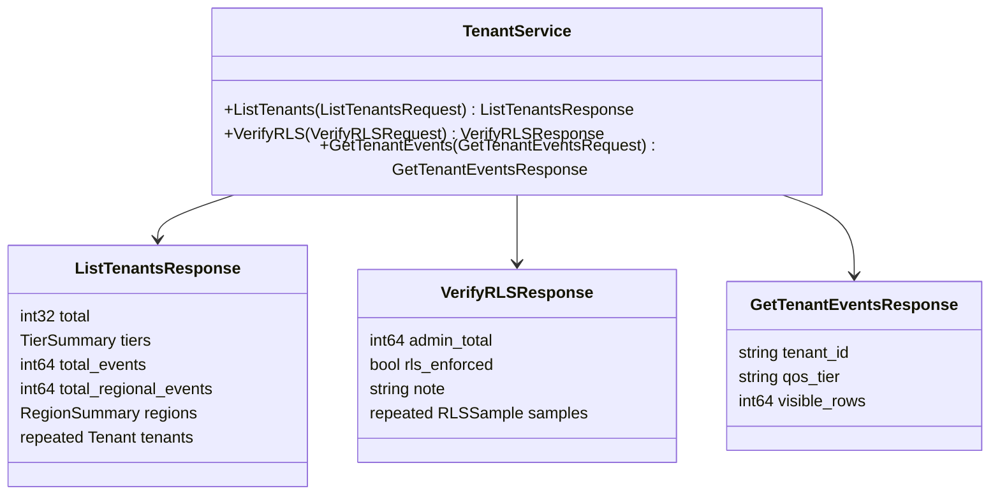

# cdbct — CockroachDB Cluster Tester

A CLI tool that orchestrates a CockroachDB cluster in Docker, drives a geo-partitioned multi-tenant workload, injects network chaos via Toxiproxy, and surfaces everything in Prometheus, Grafana, and a gRPC API. Built to demonstrate CockroachDB's resilience, Row-Level Security, and admission control under real failure modes.

Structurally mirrors [russ](https://github.com/joshdurbin/russ): same library choices (cobra, viper, zerolog, Docker SDK, pond, gofakeit), same pattern of no shell-outs — all Docker interaction goes through the Go SDK.

---

## Quick start

```bash
cdbct quickstart
```

This single command:
1. Pulls images and creates a 9-node CockroachDB cluster (3 per region) with Toxiproxy wired between the nodes
2. Assigns node localities (`us-east`, `us-west`, `eu-central`) so zone configs resolve
3. Starts Prometheus and Grafana with pre-provisioned datasource and dashboards
4. Builds and starts the workload container (seeds tenant pool, runs migrations, starts gRPC server)
5. Applies geo-partitioned zone configs with retry

```
Environment ready.

  NODE      SQL                   ADMIN UI
  1         localhost:26257       http://localhost:8080
  2         localhost:26258       http://localhost:8081
  3         localhost:26259       http://localhost:8082

  Prometheus       : http://localhost:9090
  Grafana          : http://localhost:3000
  Workload metrics : http://localhost:9091/metrics
  Workload gRPC    : localhost:9092  (grpcurl -plaintext localhost:9092 list)
```

> **Wait ~2 minutes** after quickstart before running chaos. CockroachDB's replication queue needs time to reduce the geo-partitioned table's replicas from the default 3 down to the configured 1-per-region.

---

## Prerequisites

- [Colima](https://github.com/abiosoft/colima) with at least **8 CPUs and 12 GB RAM**:
  ```bash
  colima stop
  colima start --cpu 8 --memory 12
  ```
  The default cluster is 9 nodes (3 per region). At `--cache=128MiB --max-sql-memory=256MiB` per node that's ~3.5 GB for CockroachDB alone, plus Prometheus, Grafana, Toxiproxy, and the workload container.
- Go 1.25+
- [sqlc](https://sqlc.dev) (`brew install sqlc`) — only needed if modifying queries
- [buf](https://buf.build) (`brew install buf`) — only needed if modifying the proto

---

## Architecture



All inter-node Raft RPC traffic is routed through Toxiproxy. SQL connections bypass it. Chaos commands target specific node-to-node RPC paths without touching the workload's SQL connections.

---

## Schema and data model



### `events` — resilient baseline

3 replicas, balanced across all nodes. Survives any single-node failure — leaseholder re-election in ~10s.

### `events_regional` — geo-partitioned with regional redundancy

Partitioned by `region`. Each partition has 3 replicas constrained to its home region. With 3 nodes per region, the partition survives losing any single node — 2 replicas remain, quorum is maintained.

```sql
ALTER PARTITION east OF TABLE events_regional CONFIGURE ZONE USING
    num_replicas = 3, constraints = '[+region=us-east]';
-- west → 3 replicas on us-west nodes, eu → 3 replicas on eu-central nodes
```

Partition key prefix `(region, id)` ensures inserts land in the correct range without hotspots.

### `event_counters` — write-side counters

Four rows (`global / east / west / eu`) incremented atomically inside each insert transaction. ListTenants reads from this table instead of running `SELECT COUNT(*)` — a 4-row primary-key scan instead of a full table scan.

### Row-Level Security

Both event tables have RLS enabled. `appuser` (the workload service account) can only see rows where `tenant_id = current_setting('app.current_tenant')::UUID`. Every write transaction sets `SET LOCAL app.current_tenant = '<uuid>'` before the insert.



### CockroachDB best practices applied

| Practice | Implementation |
|---|---|
| Distributed primary keys | `gen_random_uuid()` — uniform write distribution |
| No write hotspots | Region-prefixed composite PK on partitioned table |
| Geo-partitioning | `PARTITION BY LIST` + per-partition `CONFIGURE ZONE` |
| Locality-aware placement | `--locality=region=X` on each node |
| Write-side counters | `event_counters` updated in-transaction, replaces `COUNT(*)` scans |
| Planner statistics | `crdb_internal.tables.estimated_row_count` for free approximate totals |
| Multi-tenant isolation | Row-Level Security with `current_setting` session variable |
| Admission control QoS | `SET LOCAL default_transaction_quality_of_service` per tenant tier |

---

## The resilience demo

With 9 nodes (3 per region), each geo-partition has 3 replicas in its home region. The cluster now demonstrates **true regional redundancy**: losing a single node is transparent to the workload.



```bash
# Single-node partition — operations are UNAFFECTED (2/3 replicas still up)
cdbct chaos inject partition 1
# Watch Grafana: all write rates stay flat, ranges_unavailable stays 0

# Recover
cdbct chaos clear

# Two-node partition in same region — east goes down, west/eu unaffected
cdbct chaos inject partition 1
cdbct chaos inject partition 4
# Watch Grafana: east write rate → 0, unavailable ranges → >0, west/eu continue

# Recover
cdbct chaos clear
```

| Scenario | east partition | west partition | eu partition | global |
|---|---|---|---|---|
| Partition 1 node (any region) | ✓ up (2/3 replicas) | ✓ up | ✓ up | ✓ up |
| Partition 2 nodes (same region) | ✗ down (1/3, no quorum) | ✓ up | ✓ up | ✓ up |
| Partition all 3 east nodes | ✗ down | ✓ up | ✓ up | ✓ up |

---

## Commands

### Cluster

```bash
cdbct cluster create              # 9-node cluster (default, 3 per region)
cdbct cluster create --nodes=5    # larger cluster
cdbct cluster scale               # hot-add a node to a running cluster
cdbct cluster ls
cdbct cluster status
cdbct cluster rm                  # stop (keep volumes)
cdbct cluster rm --purge          # stop + delete volumes
```

### Workload

```bash
cdbct workload start                      # build image + start container (default: 10 tenants)
cdbct workload start --tenants=25         # 25-tenant pool (10 / 25 / 50)
cdbct workload start --tenants=50 --interval=200ms --batch=2
cdbct workload stop
cdbct workload ls
```

`--tenants` distributes across QoS tiers: 20% critical / 60% regular / 20% background. Pool persists across restarts.

### Regional latency baselines

`quickstart` automatically injects realistic inter-region latency into every node's Toxiproxy proxy. The values model average one-way network delay from each region to the other two, derived from well-known cloud datacenter RTTs:

| Link | RTT | One-way |
|---|---|---|
| us-east ↔ us-west | ~67ms | ~33ms |
| us-east ↔ eu-central | ~90ms | ~45ms |
| us-west ↔ eu-central | ~140ms | ~70ms |

Each proxy receives the average of the one-way delays from its region to the other two:

| Region | Nodes | Proxy latency | Derivation |
|---|---|---|---|
| us-east | 1, 4, 7 | **39ms ±5ms** | avg(33ms→west, 45ms→eu) |
| us-west | 2, 5, 8 | **51ms ±8ms** | avg(33ms→east, 70ms→eu) |
| eu-central | 3, 6, 9 | **57ms ±10ms** | avg(45ms→east, 70ms→west) |

The regional latency toxic (`crdb-node-N-latency-regional`) is distinct from user-injected toxics so they coexist and stack additively. `chaos inject latency N --latency=200` adds 200ms on top of the baseline.

```bash
cdbct chaos clear       # removes ALL faults including regional baselines
cdbct chaos regional    # re-apply regional baselines after a clear
cdbct chaos status      # shows both regional and injected toxics per proxy
```

### Chaos

All chaos targets inter-node **RPC** traffic through Toxiproxy. SQL connections are not affected.

```bash
cdbct chaos inject latency 2 --latency=200 --jitter=50   # 200ms ±50ms on node 2 RPC
cdbct chaos inject bandwidth 3 --rate=100                 # throttle node 3 to 100 KB/s
cdbct chaos inject timeout 1 --timeout=3000               # hang then close after 3s
cdbct chaos inject partition 2                            # full network partition
cdbct chaos inject reset 1                                # TCP RST, forces retries
cdbct chaos clear                                         # remove all faults
cdbct chaos clear 2                                       # remove faults on node 2 only
cdbct chaos status                                        # show active toxics with parameters
```

| Fault type | Toxiproxy mechanism | CockroachDB effect |
|---|---|---|
| `latency` | `latency` toxic | Slows Raft heartbeats; latency alerts |
| `bandwidth` | `bandwidth` toxic | Throttles replication throughput |
| `timeout` | `timeout` toxic | gRPC timeouts; leaseholder re-election |
| `partition` | proxy disabled | No TCP accepted; leaseholder loses quorum |
| `reset` | `reset_peer` toxic | TCP RST on every connection; retry storms |

### Observability

```bash
cdbct obs setup       # start Prometheus + Grafana
cdbct obs teardown
```

### Quickstart / teardown

```bash
cdbct quickstart
cdbct quickstart --nodes=5 --tenants=25 --interval=200ms
cdbct destroy         # stop everything + delete volumes
```

---

## Grafana dashboards

Both dashboards are embedded in the binary and provisioned automatically. Grafana opens with no login required.

### Geo-Partition Resilience + Multi-Tenant (`/d/cdbct-workload`)

Shows two stories simultaneously:
- **By `target`** (global/east/west/eu): write rate, errors, p99 latency — geo-partition resilience
- **By `qos`** (critical/regular/background): write rate, errors, p99 latency — admission control divergence under load

Also shows `ranges_unavailable`, `ranges_underreplicated`, `liveness_livenodes`, and liveness heartbeat latency.

### CockroachDB Overview (`/d/cdbct-crdb-overview`)

Cluster-wide: SQL statement/transaction rates, p99 latency, CPU/memory per node, range health, storage capacity.

---

## Workload gRPC API

The workload container exposes a gRPC server on `localhost:9092` with **server reflection** enabled. No `.proto` file needed on the client side.

Prometheus metrics remain on `localhost:9091/metrics`.

### Service: `cdbct.v1.TenantService`



---

### Discovery

```bash
# List all registered services
grpcurl -plaintext localhost:9092 list

# Inspect the TenantService
grpcurl -plaintext localhost:9092 describe cdbct.v1.TenantService

# Inspect a message type
grpcurl -plaintext localhost:9092 describe cdbct.v1.ListTenantsResponse
grpcurl -plaintext localhost:9092 describe cdbct.v1.VerifyRLSResponse
grpcurl -plaintext localhost:9092 describe cdbct.v1.RLSSample
```

---

### `ListTenants`

Returns the full tenant pool with QoS **and region** distribution, plus per-target write counts from `event_counters`. Two queries run in parallel — no full table scan.

```bash
grpcurl -plaintext localhost:9092 cdbct.v1.TenantService/ListTenants
```

```json
{
  "total": 10,
  "tiers":   { "critical": 2, "regular": 6, "background": 2 },
  "regions": { "usEast": 4, "usWest": 3, "euCentral": 3 },
  "totalEvents": "83100",
  "totalRegionalEvents": "83100",
  "tenants": [
    { "id": "3f2a1b4c-...", "qosTier": "critical",   "homeRegion": "us-east" },
    { "id": "8e9d0c1a-...", "qosTier": "regular",    "homeRegion": "us-west" },
    { "id": "c2b7e3f1-...", "qosTier": "background", "homeRegion": "eu-central" }
  ]
}
```

---

### `VerifyRLS`

Proves RLS enforcement. Samples one tenant **per home region** and compares their visible row count against the admin total. Per-tenant queries run in parallel using `idx_events_tenant` index scans — not full table scans.

Sampling by region is more meaningful than by QoS tier — it shows that geo-isolated tenants cannot see each other's data.

```bash
grpcurl -plaintext localhost:9092 cdbct.v1.TenantService/VerifyRLS
```

```json
{
  "adminTotal": "83100",
  "rlsEnforced": true,
  "note": "sampled one tenant per home region; visible_rows via idx_events_tenant index scan",
  "samples": [
    { "tenantId": "3f2a1b4c-...", "qosTier": "critical",   "visibleRows": "8312", "rlsEnforced": true },
    { "tenantId": "8e9d0c1a-...", "qosTier": "regular",    "visibleRows": "8290", "rlsEnforced": true },
    { "tenantId": "c2b7e3f1-...", "qosTier": "background", "visibleRows": "8305", "rlsEnforced": true }
  ]
}
```

---

### `GetTenantEvents`

Returns the RLS-filtered row count for a specific tenant UUID. Also returns `homeRegion`.

```bash
grpcurl -plaintext \
  -d '{"tenant_id": "3f2a1b4c-363c-4002-8fdc-69a18783da3a"}' \
  localhost:9092 cdbct.v1.TenantService/GetTenantEvents
```

```json
{ "tenantId": "3f2a1b4c-...", "qosTier": "critical", "homeRegion": "us-east", "visibleRows": "8312" }
```

---

### `GetRegionStatus`

**Most useful call during chaos.** Returns per-region tenant counts, QoS distributions, and partition event counts from `event_counters`. Tells you exactly which tenants are in an impacted region.

Tenant data is served from the in-memory pool (zero DB cost). Event counts are a 4-row PK scan.

```bash
grpcurl -plaintext localhost:9092 cdbct.v1.TenantService/GetRegionStatus
```

```json
{
  "regions": [
    { "region": "us-east",    "tenantCount": 4, "eventCount": "27700", "tiers": { "critical": 1, "regular": 2, "background": 1 } },
    { "region": "us-west",    "tenantCount": 3, "eventCount": "27800", "tiers": { "critical": 1, "regular": 2, "background": 0 } },
    { "region": "eu-central", "tenantCount": 3, "eventCount": "27600", "tiers": { "critical": 0, "regular": 2, "background": 1 } }
  ]
}
```

When east partition is unavailable, `eventCount` for `us-east` stops growing while the others continue. `tenantCount` tells you how many customers are affected.

---

### `ListTenantsByRegion`

Returns all tenants homed to a specific region. Use this to identify which customers to communicate with during a regional degradation.

```bash
grpcurl -plaintext \
  -d '{"region": "us-east"}' \
  localhost:9092 cdbct.v1.TenantService/ListTenantsByRegion
```

```json
{
  "region": "us-east", "total": 4,
  "tiers": { "critical": 1, "regular": 2, "background": 1 },
  "tenants": [
    { "id": "3f2a1b4c-...", "qosTier": "critical",   "homeRegion": "us-east" },
    { "id": "a1b2c3d4-...", "qosTier": "regular",    "homeRegion": "us-east" }
  ]
}
```
---

### Load testing with `ghz`

`ghz` uses `--insecure` instead of `grpcurl`'s `-plaintext`.

```bash
# Baseline: sustained 10 RPS for 30s
ghz --insecure \
    --call cdbct.v1.TenantService.ListTenants \
    --rps 10 -z 30s \
    localhost:9092

# Concurrency burst: 50 concurrent requests, 500 total
ghz --insecure \
    --call cdbct.v1.TenantService.ListTenants \
    --concurrency 50 --total 500 \
    localhost:9092

# VerifyRLS under sustained load (heavier — runs per-tenant index scans)
ghz --insecure \
    --call cdbct.v1.TenantService.VerifyRLS \
    --rps 5 -z 30s \
    localhost:9092

# GetTenantEvents for a specific tenant
ghz --insecure \
    --call cdbct.v1.TenantService.GetTenantEvents \
    --data '{"tenant_id": "3f2a1b4c-363c-4002-8fdc-69a18783da3a"}' \
    --rps 20 -z 30s \
    localhost:9092

# Saturation test: ramp to 100 RPS to observe admission control behaviour
# (critical QoS tenants continue; background QoS latency climbs)
ghz --insecure \
    --call cdbct.v1.TenantService.ListTenants \
    --rps 100 -z 30s \
    --timeout 10s \
    localhost:9092
```

---

### Regenerate proto stubs

```bash
make proto    # buf generate → internal/gen/cdbct/v1/
```

The generated Go stubs are committed to the repo. Only run `make proto` after modifying `proto/cdbct/v1/tenant.proto`.

---

## Prometheus scrape targets

| Job | Target | What it scrapes |
|---|---|---|
| `cockroachdb` | `cdbct-crdb-{1..9}:8080` | `/_status/vars` — all CRDB internal metrics |
| `cdbct_workload` | `cdbct-workload:9091` | `/metrics` — per-target + per-QoS write/read rates and latencies |

---

## Development

```bash
make build         # compile ./cdbct
make proto         # regenerate gRPC stubs from proto/
make generate      # regenerate sqlc query code from internal/queries/
make tidy          # go mod tidy + verify
make lint          # go vet
make fmt           # gofmt
make clean         # remove binary
make docker-clean  # docker system prune -af --volumes + remove all named volumes
```

Rebuild the workload container after changing any Go source:

```bash
cdbct workload stop
docker rmi cdbct-workload:latest
cdbct workload start
```

---

## Project structure

```
.
├── proto/cdbct/v1/tenant.proto   # gRPC service definition
├── buf.yaml / buf.gen.yaml       # buf proto toolchain config
├── sqlc.yaml                     # sqlc config (points at internal/queries/)
├── Makefile
├── main.go
├── cmd/
│   ├── root.go                   # cobra root, zerolog, viper
│   ├── cluster.go                # cluster create/scale/ls/rm/status
│   ├── workload.go               # workload start/stop/ls
│   ├── chaos.go                  # chaos inject/{latency,bandwidth,timeout,partition,reset}
│   ├── obs.go                    # obs setup/teardown
│   ├── quickstart.go             # one-command full environment
│   └── destroy.go                # tear down everything
└── internal/
    ├── gen/cdbct/v1/             # sqlc-generated gRPC stubs (do not edit)
    ├── db/                       # sqlc-generated query code (do not edit)
    ├── cockroach/
    │   ├── client.go             # pgx pool, goose migrations, ping retry
    │   ├── retry.go              # serialization failure (40001) retry wrapper
    │   └── zone_configs.go       # CONFIGURE ZONE with retry (applied post-migration)
    ├── chaos/
    │   └── client.go             # Toxiproxy HTTP API — fault injection + proxy management
    ├── docker/
    │   ├── manager.go            # Docker client, network/volume/label helpers
    │   ├── cluster.go            # CRDB container lifecycle, cockroach init, locality flags
    │   ├── chaos.go              # Toxiproxy container + proxy registration
    │   ├── obs.go                # Prometheus + Grafana via CopyToContainer
    │   ├── workload.go           # workload image build (source tar → ImageBuild)
    │   ├── network.go            # networkConfig helper
    │   └── grafana/              # embedded dashboard JSON + provisioning YAML
    ├── migrations/
    │   ├── 00001_initial_schema.sql   # events, events_regional, indexes
    │   ├── 00002_multi_tenancy.sql    # tenants, tenant_id, appuser, RLS policies
    │   ├── 00003_counters.sql         # event_counters (write-side counters)
    │   └── embed.go
    ├── queries/
    │   ├── schema.sql            # sqlc schema (standard PostgreSQL DDL)
    │   ├── audit.sql             # event insert + read queries
    │   └── tenants.sql           # tenant pool + counter queries
    └── workload/
        ├── runner.go             # tick loop, tenantInsert with counter increment
        ├── tenant.go             # TenantPool — seed/load, QoS distribution
        ├── grpc_server.go        # TenantService impl, reflection, parallel queries
        └── metrics.go            # Prometheus metrics server (target + qos labels)
```

---

## Libraries

Follows [russ](https://github.com/joshdurbin/russ)'s conventions throughout:

| Purpose | Library |
|---|---|
| CLI | `spf13/cobra` |
| Config / env | `spf13/viper` |
| Logging | `rs/zerolog` |
| Docker SDK | `docker/docker` v27 |
| CockroachDB driver | `jackc/pgx/v5` |
| Migrations | `pressly/goose/v3` |
| Query generation | `sqlc-dev/sqlc` |
| Proto toolchain | `buf.build` + `protoc-gen-go` + `protoc-gen-go-grpc` |
| gRPC | `google.golang.org/grpc` |
| Chaos proxy client | `Shopify/toxiproxy/v2` |
| Fake data | `brianvoe/gofakeit/v7` |
| Worker pools | `alitto/pond/v2` |
| Concurrency | `golang.org/x/sync` |
| Metrics | `prometheus/client_golang` |
